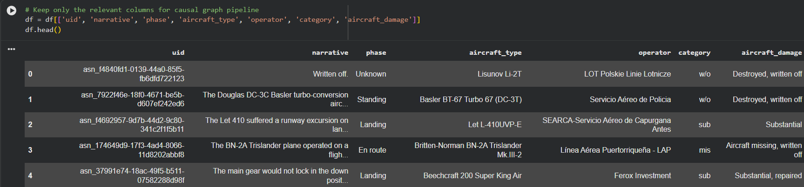
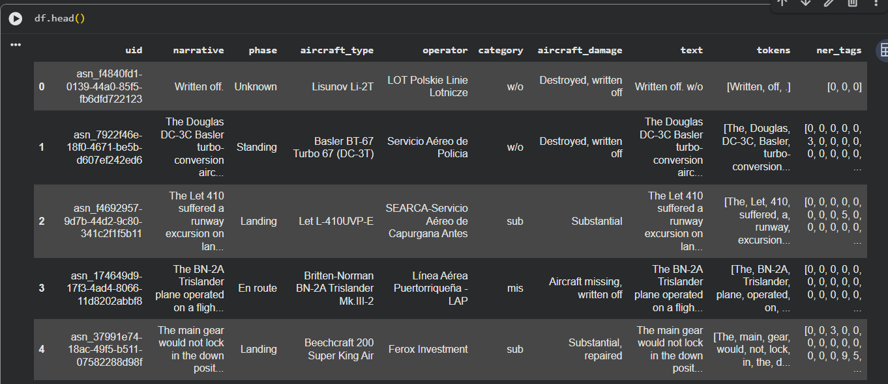
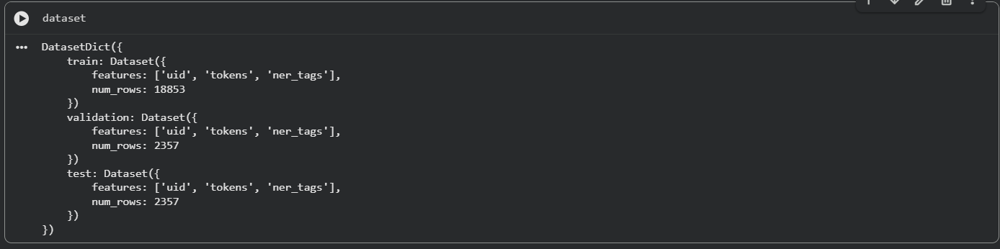
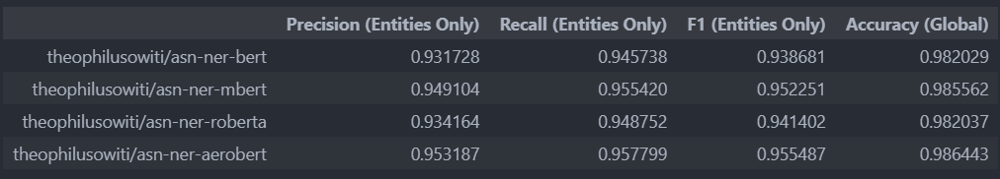
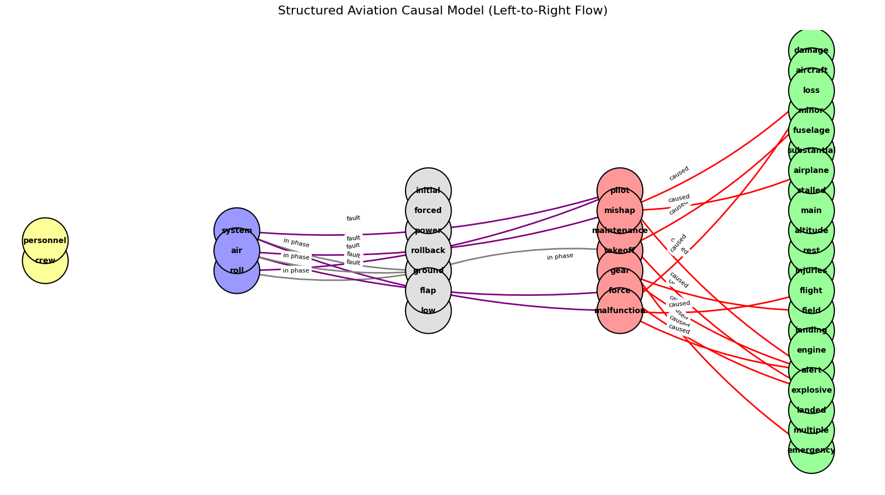
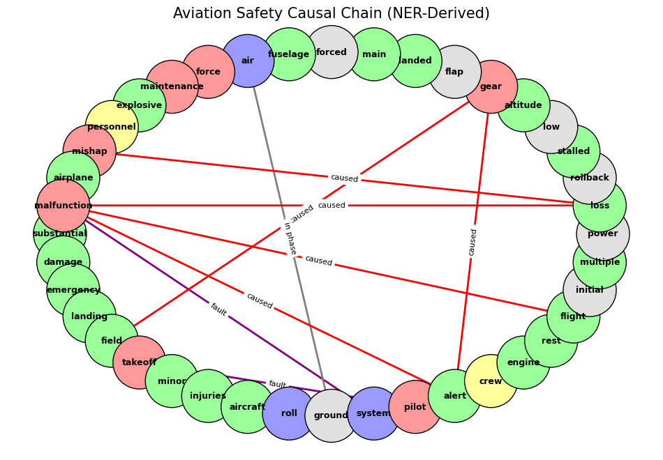
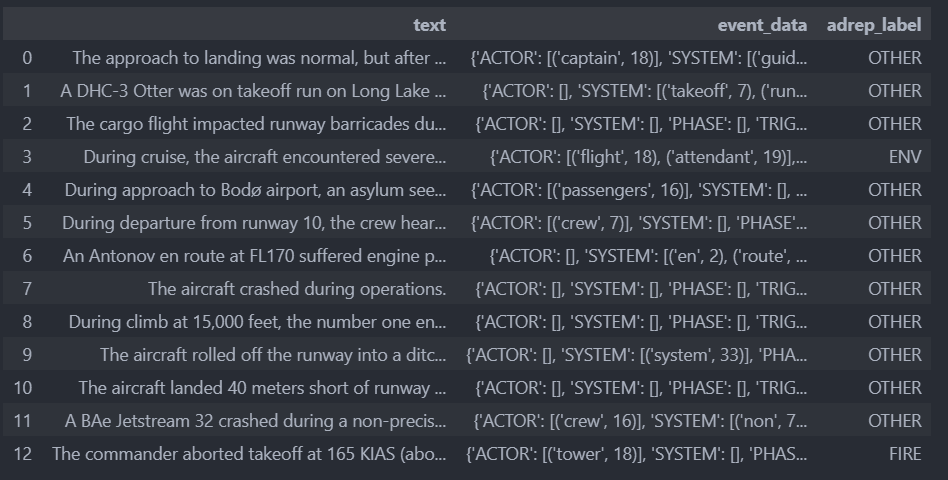
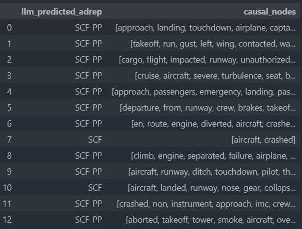

# **1. NER with mBERT Models for Classification (Approach 3)**

## **Introduction**

This is part of a collaborative research project at CMU in Deep Learning, the course code is 18-786 (Introduction to Deep learning). This code was written by the team member Theophilus Owiti, and part of it was contributed by the team members who are equal collaborators in this project section. Other project section are shared in the main repository.

**Members:**

- Theophilus
- Whoopie
- Ronnie

This section handles the classification of aviation reports using Named Entity Recognition (NER) via BERT-based architectures. The models utilized in this research include:

* **BERT Uncased:** A standard baseline for English language understanding.
* **RoBERTa:** An optimized version of BERT with improved training measures.
* **DistilBERT:** A lightweight, faster version of BERT for efficient processing.
* **NASA's SafeAeroBERT:** A domain-specific model pre-trained on the Corpus of Aviation Safety Reports (CASR), designed to understand specialized aviation terminology and syntax.

**Not Running this Project on Google Colab?**

Please install libraries using:

```bash
source .venv/bin/activate
```
OR if using windows/PC

```powershell
.venv\Scripts\Activate.ps1
```

Then do the following to install the required libraries

```bash
pip install -r requirements.txt
```

[**WARNING**] This project required GPU to run therefore it is best to use Google Colab to run this where a notebook has been provided to run this step by step and follow easily. But if you have enough VRAM and a good GPU then do not hestitate to run the code, but note the file paths used must be changed according to where assets are.

[**NOTE**] Code here runs the training and evalution only and all other applicable cases of the model can be used with the `DL_Group_NB_Spring.ipynb` notebook.

## **1.1 Data Processing and NER Labelling**

The data processing pipeline began by loading raw records from the project database using `dataset.py`. The resulting dataset was exported as `asn_scraped_ds.csv` for analysis. Using the Pandas library, we identified several high-utility columns—`phase`, `aircraft_type`, `operator`, and `narrative`—to serve as the foundation for our labeling strategy.

**How to load the data**

First you need to change the remote/local database URI you are using, therefore fill the below with an appropriate URI (some people call it a URL):

```bash
db_url = "postgresql://<user>:<password>@XXX.XX.XX.XXX:PORT/aviation_db"
```

Then create your `.csv` file using the command below:

```bash
python dataset.py
```

You will see the .csv file created in the root directory if it was not there previously.

[**WARNING**]: Do this only if you have access to the remote db for the web scraped data, otherwise by default `asn_scraped_ds.csv` should have been provided for you. Cheers!

**Loaded data columns**




### **1.1.1 Rule-Based BIO Tagging Strategy**

To automate the labeling of thousands of narratives, a rule-based system was implemented. This system utilizes the **BIO (Beginning, Inside, Outside)** format. This format is essential for the model to learn the boundaries of multi-word entities, such as distinguishing between "First" (a sequence start) and "Officer" (a sequence continuation).

**The Label Schema:**

| Label | ID | Description |
| :--- | :--- | :--- |
| `O` | 0 | Outside (Non-entity/Punctuation) |
| `B-ACTOR` / `I-ACTOR` | 1 / 2 | Organizations or persons (e.g., "ATC", "Captain") |
| `B-SYSTEM` / `I-SYSTEM` | 3 / 4 | Aircraft and technical components (e.g., "FMC", "UAS") |
| `B-PHASE` / `I-PHASE` | 5 / 6 | Flight stages (e.g., "Taxi", "Final Approach") |
| `B-TRIGGER` / `I-TRIGGER` | 7 / 8 | Inciting incidents (e.g., "Deviation", "Engine Failure") |
| `B-OUTCOME` / `I-OUTCOME` | 9 / 10 | Results/Recovery (e.g., "Go-around", "Stall") |

### **1.1.2 Implementation Pipeline**

#### Manually Annoted Data

This data is easily found in `NER_labels_aviation.json` where these labels are used to actually drive the Rule based annotation given that the required NER token classification have been picked and curated from the same dataset. An example of the annotation in json is shown as below:

```json
{
    "ACTOR": [
        "Police", "ESMAD", "Pilot", "Crew"
        
    ],
    "SYSTEM": [
        "Fuselage", "Engine", "Gearbox", "Clutch"
        
    ],
    "PHASE": [
        "Boarding", "Positioning", "Landing","Touchdown","Departure"
         
    ],
    "TRIGGER": [
        
    "Unremoved", "chock","Gravel", "touchdown"
     
    ],
    "OUTCOME": [
        "Ruptured", "Destroyed", "Damaged", "Broken"
    
    
    ]
}
```

The labeling logic iterates through both row-specific metadata (like `operator`) and an expanded global vocabulary of aviation terms. By sorting search terms by length (descending), the script ensures that a phrase like "First Officer" is tagged correctly as a single entity rather than being split into "First" and "Officer" independently.

```python
import pandas as pd
from nltk.tokenize import word_tokenize
from datasets import Dataset, DatasetDict

def rule_based_annotate(row, vocab_dict, label_map):
    
    text = str(row['narrative'])
    tokens = word_tokenize(text)
    ner_tags = [0] * len(tokens)
    
    
    entities_to_check = {
        "ACTOR": [str(row['operator'])],
        "SYSTEM": [str(row['aircraft_type'])],
        "PHASE": [str(row['phase'])]
    }
    for label, words in vocab_dict.items():
        entities_to_check.setdefault(label, []).extend(words)

    for label_type, search_list in entities_to_check.items():
        
        sorted_search = sorted([str(s) for s in search_list if len(str(s)) > 2], 
                               key=len, reverse=True)
        
        for entity_str in sorted_search:
            entity_tokens = word_tokenize(entity_str)
            n = len(entity_tokens)
            for i in range(len(tokens) - n + 1):
                if ner_tags[i] == 0: # Avoid overwriting existing tags
                    if [t.lower() for t in tokens[i:i+n]] == [et.lower() for et in entity_tokens]:
                        ner_tags[i] = label_map[f"B-{label_type}"]
                        for j in range(1, n):
                            ner_tags[i+j] = label_map[f"I-{label_type}"]
    return tokens, ner_tags
```

**Statistics of NER labels**

```markdown
ACTOR: 466 words loaded
SYSTEM: 593 words loaded
PHASE: 684 words loaded
TRIGGER: 928 words loaded
OUTCOME: 804 words loaded
```

Labelled data that tries to conform to the ConII 2003 Dataset:



### **1.1.3 Transformation to DatasetDict**

For compatibility with the Hugging Face `transformers` library, the processed DataFrame is converted into a `DatasetDict`. This structure facilitates efficient training, validation, and testing splits.

```python
#Convert to Hugging Face Dataset format
raw_ds = Dataset.from_pandas(df[['uid', 'tokens', 'ner_tags']])

#Split into 80% Train, 10% Validation, 10% Test
train_testvalid = raw_ds.train_test_split(test_size=0.2)
test_valid = train_testvalid['test'].train_test_split(test_size=0.5)

dataset = DatasetDict({
    'train': train_testvalid['train'],
    'validation': test_valid['train'],
    'test': test_valid['test']
})
```

**The dataset created for NER with manual match labels**



### **1.1.4 Handling Punctuation**

In this pipeline, punctuation is intentionally preserved as independent tokens assigned the `O` tag. In aviation reports, punctuation often acts as a structural boundary between a **TRIGGER** and an **OUTCOME**. Preserving these tokens allows models like **SafeAeroBERT** to leverage the natural rhythm of the report to improve classification accuracy for causal graph construction.

[**Note**] You can get the HuggingFace compatible dataset in this repositoy under data. It is found in the zip folder: `data/aviation_ner_dataset.zip`

## **2.0 Training and Evaluation**

In this section we now use the NER labeled dataset to fine-tune our BERT models and make a comparison. This section uses a hugging face repository by Theophilus Owiti with user name `theophilusowiti` to store the resultant models for use in production or further research and improvement of the models. The trained and stored models in hugging face correspond to the above mentioned models as:

```markdown
Models IDs (Hugging Face 🤗):

- "theophilusowiti/asn-ner-bert"
- "theophilusowiti/asn-ner-mbert"
- "theophilusowiti/asn-ner-roberta"
- "theophilusowiti/asn-ner-aerobert"
```

### **2.1 Results using the F1-Score, Precision, Recall Metrics**



The results table show the performance of the different models and the consideration of the model to use was based on the F1-Score which was **SafeAeroBER** dubbed as **theophilusowiti/asn-ner-aerobert** to be used in the NER token classification process and we can create a graph later on with the model then we finally run it through a simple parser for ADREP classification.

Below is the individual F1-Score per class:

- ACTOR F1: 0.9276
- SYSTEM F1: 0.9331
- PHASE F1: 0.9434
- TRIGGER F1: 0.9520
- OUTCOME F1: 0.9689

### **2.2 ADREP Classification**

**Classification to ADREP using Logic Based Classifier based on the NERs**

In this section we use an AI-generated ADREP classification map/dictionary to assit in testing ADREP classification performance, question asked previously, can we reduce the rate at which misclassification happens with reports being put into the **OTHER** Class:

```python
#AI-Generated ADREP map
ADREP_MAP = {
    # 1. SCF-PP: System/Component Failure (Powerplant)
    "engine fire": "SCF-PP", "engine failure": "SCF-PP", "flameout": "SCF-PP", "oil leak": "SCF-PP",
    
    # 2. SCF-NP: System/Component Failure (Non-Powerplant)
    "gear failure": "SCF-NP", "hydraulic leak": "SCF-NP", "avionics": "SCF-NP", "flap failure": "SCF-NP",
    
    # 3. ENV: Environmental (Weather/Turbulence)
    "turbulence": "ENV", "windshear": "ENV", "icing": "ENV", "lightning": "ENV", "thunderstorm": "ENV",
    
    # 4. WILD: Wildlife (Birds/Animals)
    "bird strike": "WILD", "wildlife": "WILD",
    
    # 5. FIRE: Fire/Smoke (Non-engine related)
    "smoke": "FIRE", "cabin fire": "FIRE", "fumes": "FIRE",
    
    # 6. LOC-I: Loss of Control - Inflight
    "stall": "LOC-I", "upset": "LOC-I", "spin": "LOC-I", "unusual attitude": "LOC-I",
    
    # 7. ARC: Abnormal Runway Contact
    "hard landing": "ARC", "tail strike": "ARC", "nose gear collapse": "ARC",
    
    # 8. RE: Runway Excursion
    "overrun": "RE", "veered off": "RE", "excursion": "RE",
    
    # 9. GCOL: Ground Collision
    "collision": "GCOL", "pushed into": "GCOL", "tug": "GCOL",
    
    # 10. FUEL: Fuel Related
    "exhaustion": "FUEL", "starvation": "FUEL", "low fuel": "FUEL", "contamination": "FUEL",
    
    # 11. OTHR: Other (For things that are specific but don't fit above)
    "medical emergency": "OTHR", "laser": "OTHR", "unruly passenger": "OTHR"
}
```

Utilizing out simple parser to help classify these documents:

```python
def classify_adrep(event):
    
    for trigger, pos in event["TRIGGER"]:
        trigger_lower = trigger.lower()
        if trigger_lower in ADREP_MAP:
            return ADREP_MAP[trigger_lower]
    return "OTHER"
```


### **2.3 Building the Cusal Graph**

In this section we utilize networkx to give as a view of the causal relationship that we have. Below we have the following resultant graphs from the created network using the NER model (**asn-ner-aerobert**).

**Structured Aviation Causal Model (Left-to-Right Flow) [Recommended for Use]**



In our example report as show below that resulted to the above graph:

```python
sample_text = "A USAF C-130 transport plane sustained substantial damage in an emergency landing in a barren field shortly after takeoff from Baghdad. The 38 occupants suffered minor injuries,Sixty seconds after the aircraft began its takeoff roll from Baghdad International Airport, Iraq, at approximately 313 feet above the ground and 163 knots indicated airspeed, the airplane's defensive system activated. The pilot reacted in accordance with applicable directives. After reacting to the defensive alert the crew realized that RPM on engine numbers 1, 3, and 4 had decayed to 60% where it remained for the rest of the flight.After initial analysis. the crew initiated the multiple engine power loss/RPM rollback checklist to regain power on the stalled engines. Due to the low altitude and airspeed at the time of the defensive alert/reaction and the unexpected three engine power loss the crew was unable to complete the checklist and recover the malfunctioning engines. The crew initiated landing gear and flap extension but landed, partially gear down, in a barren field. Part of the main landing gear legs were forced into the fuselage, splitting part of the floor.U.S. Air Force Maintenance and Explosive Ordinance Disposal personnel from the 447th Air Expeditionary Group were called in. They placed explosive charges on the plane and blew up the Hercules on July 7.The Board President could not find clear and convincing evidence to determine the exact cause of the engine power loss. He did find evidence to conclude that several factors combined to significantly contribute to the Mishap Airplane (MA) landing partially gear down. Specifically, a defensive system alert, the aircraft's low altitude and airspeed at the time of the malfunction, and the decision to respond to the alert at low altitude and airspeed combined to result in the MA landing partially gear down.All MA systems and performance were normal prior to the defensive system alert. An undetermined malfunction occurred during the defensive reaction that caused three of the MA's four engines to stabilize at an RPM (60%) which was not sufficient to maintain flight and the low altitude and airspeed at the time of the malfunction limited the time available for situation analysis and recovery.The Mishap Crew (MC) had never been exposed to a loss of three or four engines on takeoff in the C-130H2 simulator which resulted in an emergency situation the MC had not seen before at a low altitude and airspeed. Checklist actions taken by the MC did not recover the engines and the Mishap Pilot (MP) appropriately performed a limited power, controlled descent, and forced landing resulting in only minor injuries."
```


One can now clearly see the flow of the narrative from left to right: Actors $\rightarrow $ Systems $\rightarrow $ Triggers $\rightarrow $ Outcomes.

However, looking at the right side of our graph, we have a "Causal Explosion." Many lines are pointing to the same green circles because your current logic is likely connecting every Trigger to every Outcome in the entire text. The lane structure is functioning as intended, with ACTORS (yellow: crew, personnel) correctly isolated on the far left. The logical flow is clear, as the purple fault lines accurately depict transitions from SYSTEM elements (blue: air, roll, system) to intermediate PHASE/TRIGGER states (gray/red). However, some over-labeling is present, such as “takeoff” being marked as a red Trigger/Outcome. Since takeoff represents a phase rather than a causal failure, it should be categorized as a PHASE (gray) to ensure red causal lines remain reserved for actual malfunctions or mishaps.

**Casual Chain (NER Derived)**



The image above highlights the "Curse of Complexity" in Knowledge Graphs. While it's impressive that your NER model (SafeAeroBERT) is extracting so many entities, the graph has become a "hairball"—there is too much noise to identify the actual root cause.

### **3.0 ADREP Classification**

**Results of ADREP Classification with NER model and Parser**



The above data shows results on a small AI-generated set of reports based on some of the test samples about 12. The following shows a rough results on how this approach performs.

# **Testing Graph on Knowledge-GRAPH RAG [Experimental]**

Here we use `meta-llama/Llama-3.2-1B-Instruct` model to perform this test.




